# Front-End Movies

Initial plan of homepage:
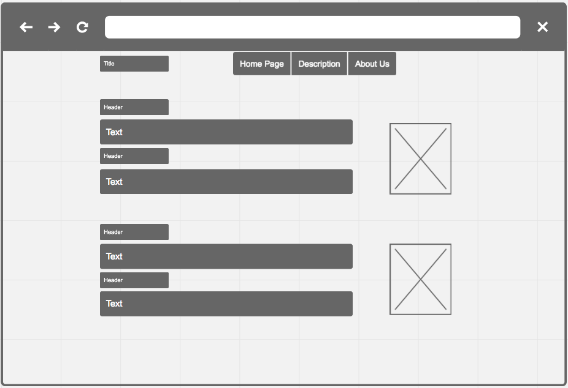

Initial plan of description page:
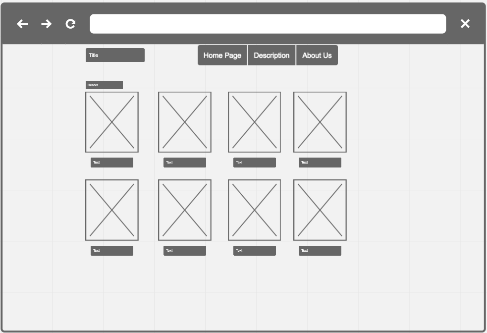

Initial plan of about page:
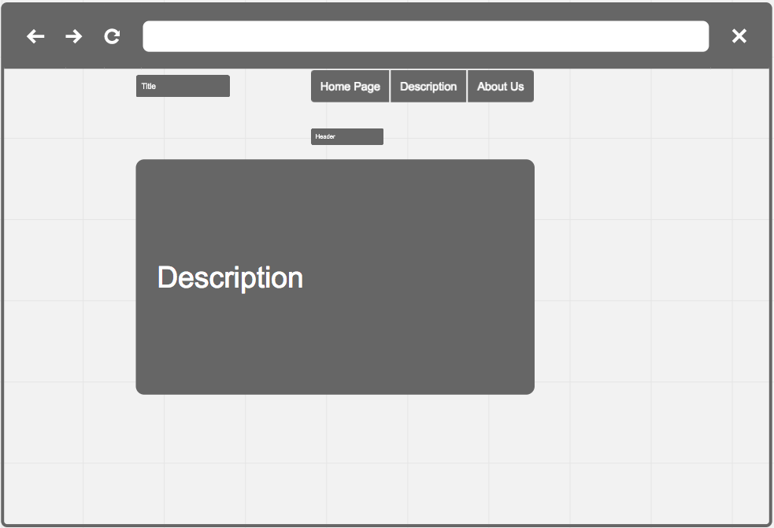

Updated site map for the website:

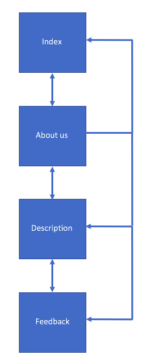

For the prototypes of the website, Proto.io had been used.

Prototype of homepage:

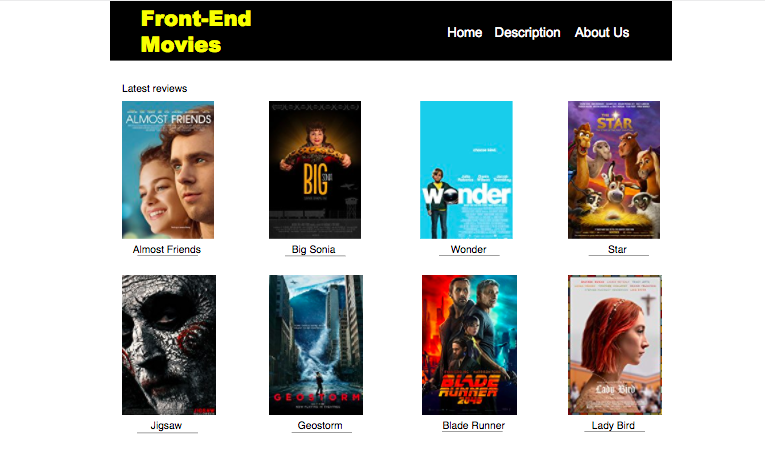

Prototype of description page:

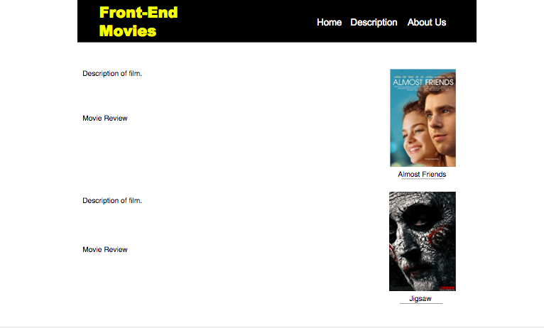

Prototype of about us page:

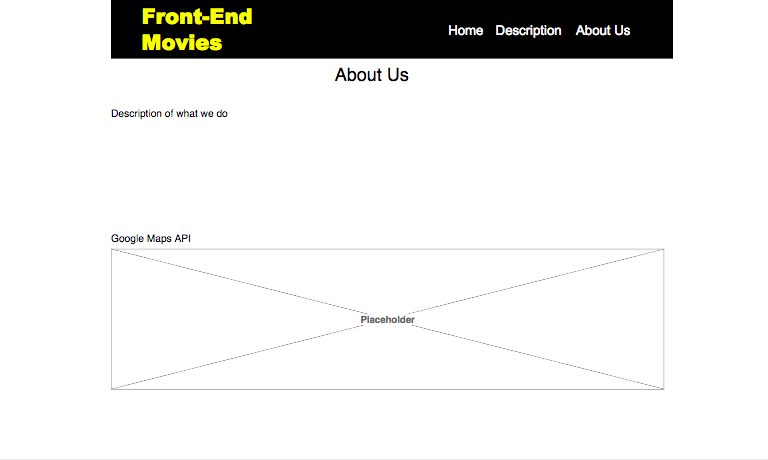

Prototype of mobile homepage:

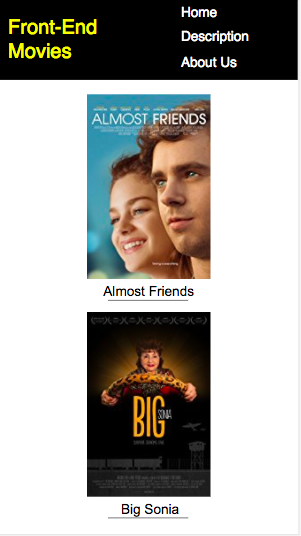

Prototype of mobile description page:

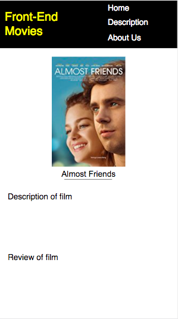

Prototype of mobile about us page:

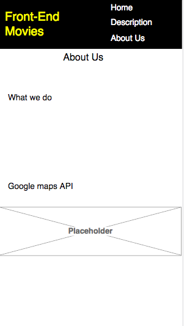

The website created is a movie review website thats layout and theme took inspiration from IMDB, following a yellow-black colour theme and similar layout.  The issues that had been encountered had included trying to implement the '.active' feature in the CSS for the navigation bar, this feature was meant to be there for the purpose of the user knowing what page they are currently on. Also, when a Google Maps API had been called in, and had ran that page (about us) through the HTML validator, it had shown 1 error, this was to put all design attributes into the CSS rather than in the iFrame in the HTML document.

In terms of accessibility, 'alt' tags were used, this is because if the respective image did have any issues with loading then the description of the alt tag will show and also kept good contrast between background, images, and text.

All pages and stylesheets were manually inputted into the relevant validation website by W3C, this was done for CSS and HTML.

Validation of homepage:

![Validation of homepage] (DesignWireframes/Homepage.png)

Validation of description page:

![Validation of description page] (DesignWireframes/Desc.png)

Validation of about us page:

![Validation of about us page] (DesignWireframes/About.png)

Validation of feedback page:

![Validation of feedback] (DesignWireframes/FeedbackV.png)

PARC
Proximity
The way images and text were laid out had spacing between them and not everything was forced together or around each other.
Alignment
The alignment of images had always stayed clean, neat, and consistent throughout the website, the alignment had changed only with the media breakpoints.
Repition
The positioning of the navigation, the font, and positon of the logo was repeated throughout all the pages. This is because if it changes around it can make the site less user friendly and cause confusion.
Contrast 
There was contrast between the background, images, and writing. This is important so there is no colour clash and giving difficulties when reading or viewing images. This relates to accessibility as it makes it easier to read especially for those who have visual impairments.

IA - The navigation is very simplistic and pages are linked, every other page is accessible from one page. The logo is consistent in the same place and also when clicked takes the user back to the homepage.

JavaScript was applied within the navigation bar, after research it was found that a navigation bar could be implemented using JavaScript. For CSS, the use of @keyframes and webkits were present to give the images on the homepage transitions, however, the @keyframes related to  .fadeInRight and .fadeInLeft had displayed parse errors and the webkits had displayed as warnings (see below). These errors and warnings typically appear due to the differences in browser compatabilities.

CSS Validation:

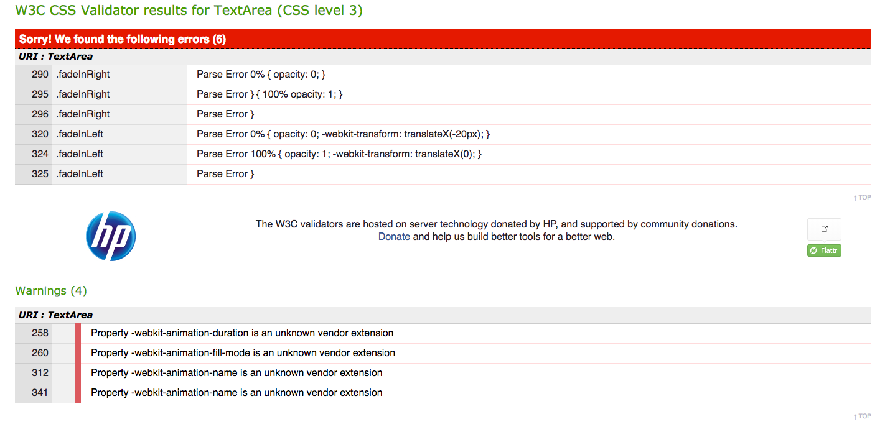

For user testing, a new page was created called 'Feedback' and within this page a Typeform questionnaire was called in. The website was shown to 6 people, and at the end of the browsing period they were told to click the 'feedback' button where the questionnaire would initiate. The questionnaire consisted of questions about navigation, layout, and accessibility. From the user feedback, the main issue that was found was that the description page had images that had an 'ease in' effect, so when the user hovers over the image, the image would push back slightly making the user think it is interactable, however it was just an ordinary picture with a figcaption. After this feedback, the effect was removed. On the other hand, respondents had said that navigating through the website was easy and the navigation bar was not too confusing.

Part 1 of responses:

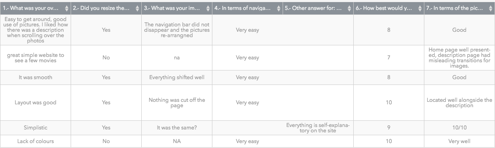

Part 2 of responses:

![Part 2 of responses] (DesignWireframes/Feedback.png)

Code responsible for the effect:

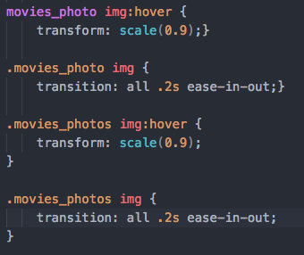

Mouse rollover with effect:

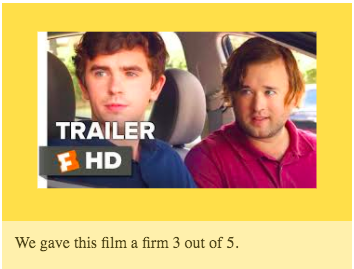

Mouse rollover without effect:

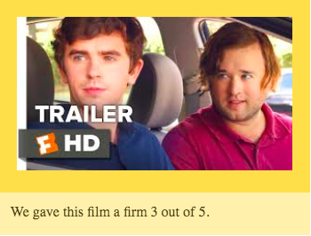